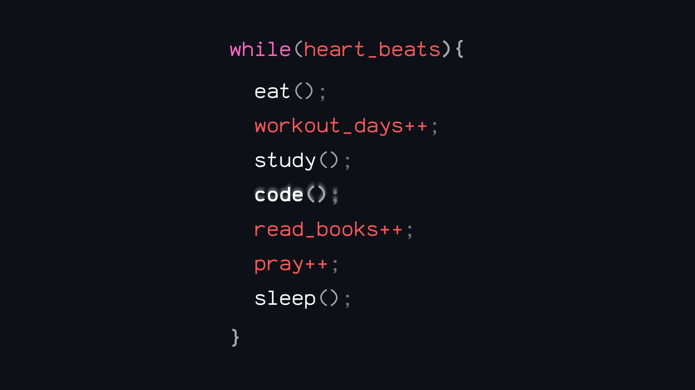

<h1 align="center">👩🏻💻 Hello World! ✨💯</h1>

###

Hello 👋, I'm Larissa Cravo! A future software developer and currently student from Brazil.  📕 I’m doing my 2º grade in High School and studying Machine Learning by my own.  🖥️  I am looking for a job opportunity. My dream is be a Software Engenieer, work with IA and Machine Learning.

###

<!--     -->
  
    
<!--      -->

###

<h2 align="left"></h2>

###

<h3 align="left">Programing Languages (in order of level domain)</h3>

###

  
  
  
  
  
  
  
  
  
  
   
  
  

###

<h3 align="left">Site programings softwares (in order of level domain)</h3>

  
  
  

<h3 align="left">Frameworks</h3>

###

  
  
  
  

###

  

###

  
  
  

###

  

###

<h2 align="left"></h2>

###

<h3 align="left">🧠 Soft Skills</h3>

###

🤠Leadership   🯠Proactivity  💪 Willingness to learn  💡 Creativity  💖 Empathy

###

 

